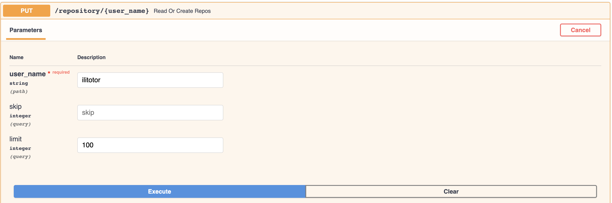
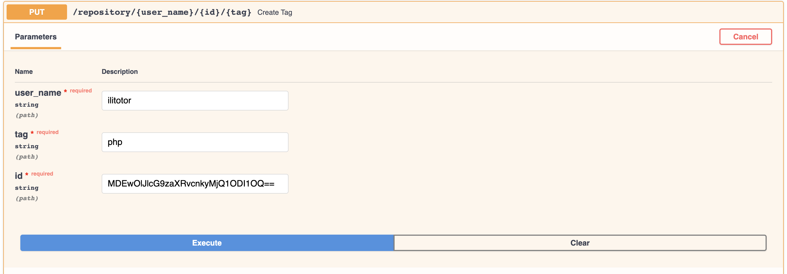
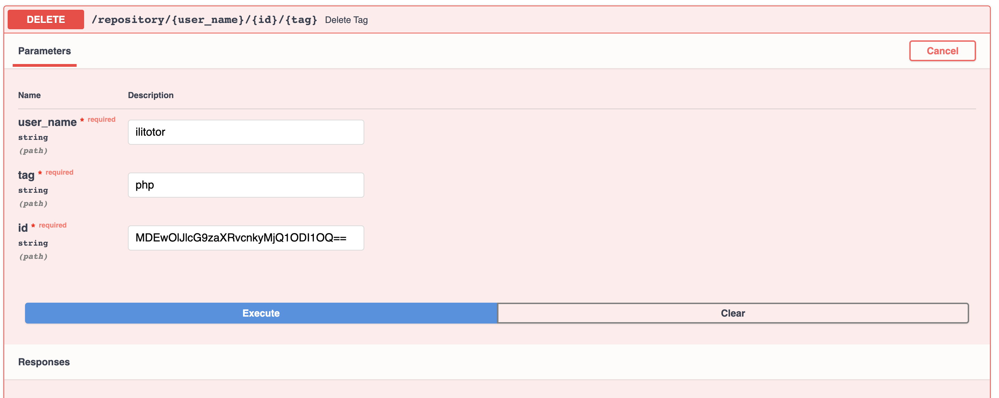

#  brainn.co Challenge

Go to the project directory and build Brainnco image:

```docker build . -t brainnco```

Then run:

 ```docker run -p 8000:8000 brainnco```   
 
To access the API documentation:
  
 ```http://0.0.0.0:8000/docs#/```

#### Get/Put


#### Put Tag


#### Delete Tag



## Test 
1. Run  ```docker ps```
2. Run ```docker exec -it <container-id> bash  ```
3. Run ```python -m pytest```

